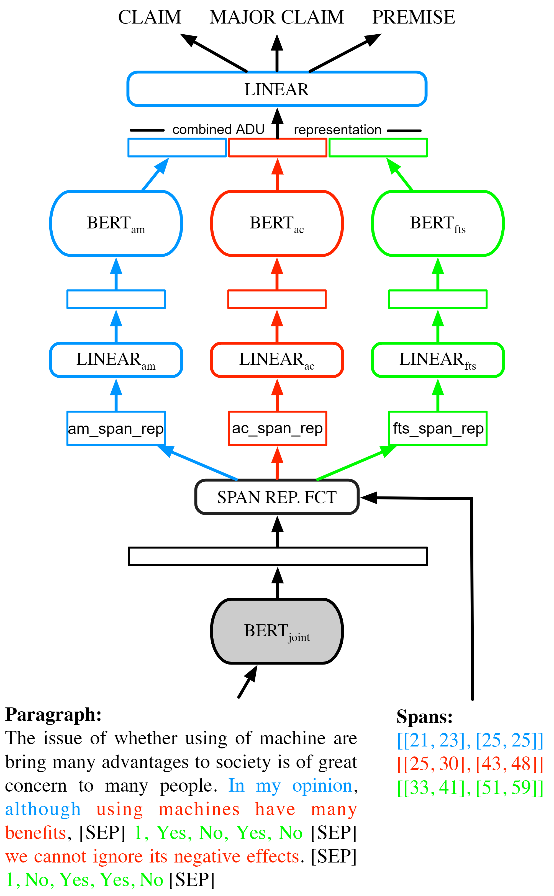

# Argument Mining with Modular BERT with Selective Fine-tuning

**Abstract:** In this paper, we present a modular, transfer learning enabled BERT--MINUS-FeaTxt model for Link Identification and Argument Type Classification sub-tasks of Argument Mining in the Persuasive Essays dataset. The BERT--MINUS-FeaTxt model consists of four modules: the first module embeds the essay paragraph text. The other three modules contextualize the argument markers, arguments components and Features as Text, respectively. To enable transfer learning, we introduce the Selective Fine-tuning process which implements two kinds of transfer learning in our BERT--MINUS--FeaTxt model: auto-transfer (transfer learning from a task to itself) and cross-transfer (classical transfer learning from one task to another). Our modular BERT--MINUS--FeaTxt model achieves state-of-the-art results on the Link Identification task and competitive results on the Argument Type Classification task. The synergy between the Features as Text mechanism and transfer learning via the Selective Fine-tuning process significantly improve the performance of the model. Our work reveals the importance and potential of Selective Fine-tuning in modular Large Language Models. Moreover, our work dovetails naturally into the Prompt Engineering paradigm in NLP and AI.

# Model

We introduce a modular BERT-based model, called  BERT--MINUS, which consists of four BERT models, a custom Features as Text (FeaTxt) sentence representation, and a Selective Fine-tuning process for transfer learning.

The BERT--MINUS model works as follows: the Joint Module embeds a complete input paragraph which consists of several Argumentative Discourse Units (ADU) to be classified. Taking this paragraph embedding as input, the Span Representation Function computes span-based representations for argument markers, argument components, and additional features -- given as text. Subsequently, the Dedicated Module, composed of three BERT models, contextualizes these span representations separately to better capture the flow between them. These contextualized representations are then concatenated to obtain a combined representation of the ADU which is finally fed to a classification layer.

<p align="center">

</p>

# Data

We experiment on our model with the Persuasive Essays (PE) which is a collection of 402 structured and argumentative written essays on various topics. 

The raw dataset can be accessed at: https://tudatalib.ulb.tu-darmstadt.de/handle/tudatalib/2422

The contextual, structural and syntactic features and the spans for the dataset have been pre-computed separately. All datasets in the PyTorch ready ``.pt`` format are given in the ``/datasets`` folder.

# Tasks

We train our model for three tasks: 

1) **Link Identification (LI)** Task: given an argument component, classify it as either *Linked* or *Not Linked* to some other argument.
2) **Argument Type Classification** (ATC) Task: given an argument component, classify it as *Major Claim*, *Claim*, or *Premise*.
3) **Link Type Classification** (LTC) Task: Link Type Classification (LTC): given a linked argument component, classify whether its link is of a *Support* or an *Attack* type.


# Notebooks

The notebooks used for the experiments are given in the ``/notebooks`` folder. More detailed explanation about the usage is provided in the ``README`` file in the folder.

# Requirements

We use the following versions of the packages:

```
torch==1.10
transformers==4.12.5
datasets==1.15.1
tensorboard==2.6.0
```

# Platform

All experiments have been performed on Paperspace's Gradient cloud AI/ML platform: https://gradient.run/
